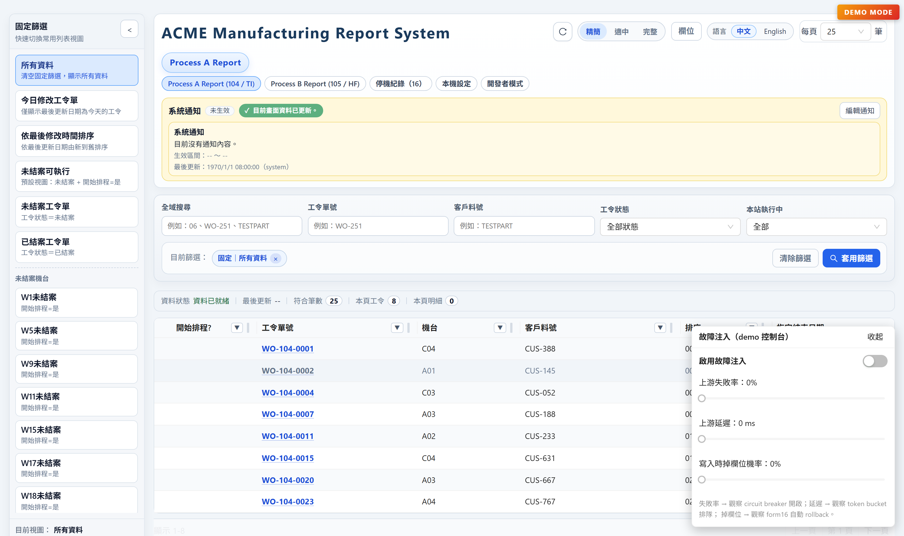
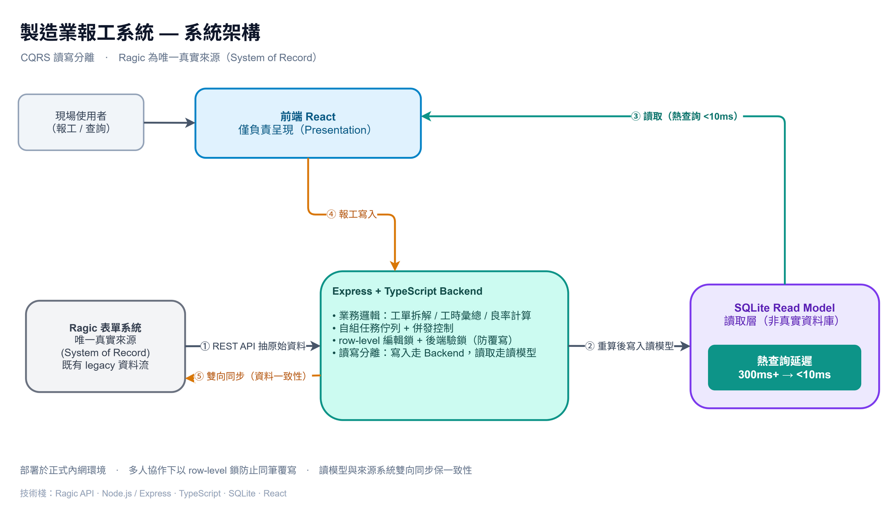

# 報工系統 — Demo 版

> 內網生產用的工廠報工管理系統，原為自有部署，本 repo 已加入 **Demo Mode**：上游 no-code SaaS DB 替換成記憶體假倉，可以 zero-config 在本機完整啟動。



技術棧：**React 19 + Vite 7 + AntD 6** 前端／**Express 4 + TypeScript 5.9 + Node 20 + SQLite** 後端。

右下「故障模擬」panel 是 demo 專屬控制台，可即時注入 **上游失敗率 / 上游延遲 / 寫入時掉欄位** — 對應展示 circuit breaker / token bucket 排隊 / Form 16 write verifier 自動 rollback 三條防線。

---

## 30 秒啟動

需要 Node 20+。

```bash
# 後端
cd backend
npm install
npm run demo

# 另開 terminal
cd frontend
npm install
npm run dev
```

打開 [http://localhost:5173](http://localhost:5173)，右上角會看到「DEMO MODE」徽章，列表已預載 80 筆假工令、約 400 筆報工列、150 筆停機紀錄。

> 啟動時 80 筆工令與 6 條 linked source 表（機台 / 操作員 / 工序）會 deterministic 生成。重啟服務會回到初始 fixture。

---

## 系統架構



讀寫分離（CQRS）：報工寫入先經 Backend 處理業務邏輯，再同步回 Ragic（唯一真實來源），同時重算寫入 SQLite 讀模型；前端讀取一律走讀模型，熱查詢從 300ms 以上壓到 10ms 以內。

---

## 核心技術亮點

這套系統是給工廠作業員 24 小時運作的內網生產系統。Demo 保留了下面所有機制（除了上游 SaaS 改成 mock），可以在面試現場一邊操作 UI 一邊講設計考量。

### 上游治理（[backend/src/infra/](backend/src/infra/)）
- **Token bucket 全域限流** — `RAGIC_GLOBAL_RATE_PER_SECOND` + `BURST_CAPACITY`，4 條 lane（user / sync / background / write）共用同一個 bucket，避免 22 個 slot burst 打爆上游
- **多 lane scheduler** — user / sync / background / write 各自獨立 concurrency，背景任務不會擠掉使用者請求
- **Circuit breaker** — 連續失敗 N 次 cooldown，retry 移出 lane（背壓不阻塞 slot）
- **Read/Write retry** — 分讀寫策略，read 可重試、create 不重試（避免重複建立）

### 讀取分層（[backend/src/services/work-report/](backend/src/services/work-report/)）
- **三層快取**：node-cache（記憶體）+ full snapshot cache（檔案）+ SQLite read model
- **Preview-first**：列表預設只讀主表欄位、面板互動才 on-demand full hydration
- **Stale-while-revalidate** 模式 + 啟動預熱（demo 下關閉）

### 寫入一致性
- **Idempotency**：`x-client-mutation-id` 透過 `clientRowKey` 對應上游 rowId，重送同 ID 不會重複建立 — 見 [backend/src/services/workReportService.ts](backend/src/services/workReportService.ts)
- **Form 16 ↔ Form 104/105 子表連動**：報工列建立在 Form 16 (停機紀錄)，由上游 workflow 自動推回工令子表；mock 在 [backend/src/ragic/mockClient.ts](backend/src/ragic/mockClient.ts) 模擬同樣的 propagation 語意
- **Write verify**：create 完立刻讀回比對，欄位不一致就自動 DELETE 止血（避免 orphan 種子）
- **Post-create polling**：拿到 form 16 rowId 後輪詢工令子表確認 row 出現再回應

### 即時推送（[backend/src/events/realtimeEventBus.ts](backend/src/events/realtimeEventBus.ts)）
- Server-Sent Events 全域 bus，每次 mutation 發布 form / row update 事件
- 前端 [useWorkReportListDataSync](frontend/src/features/work-report/hooks/useWorkReportListDataSync.ts) 自動 reconnect、去重、deferred refresh

### 觀測性 / 開發者模式
- 後端結構化日誌（Pino）+ 全棧 boot/deploy version
- 前端 [Developer Contract](frontend/src/features/work-report/debug/workReportDeveloperContract.ts) — ui / api / task / realtime / navigation 事件契約全紀錄
- 診斷面板可即時查 hydration source、cache state、SSE 連線、SQLite snapshot age

### 認證 / 多裝置
- env-fallback admin + scrypt 密碼雜湊 + 多帳號管理（[backend/src/services/userManagementService.ts](backend/src/services/userManagementService.ts) 等）

### 資料治理
- **Record audit log**：每筆 update / delete 全量前後快照、操作人、時戳，前端 UI 可看歷史
- **Form 16 孤兒清理**：背景週期掃 createdAt > 10 分鐘且符合條件的記錄做 soft delete（demo 下關閉）

---

## Demo 模式運作

| 元件 | 真實版 | Demo 版 |
|---|---|---|
| 上游讀寫 | HTTPS → `demo.local/...` | 記憶體 Map，毫秒回應 |
| SQLite read model | 啟動同步 | 仍可用，但預設不預載（避免冷啟動延遲）|
| Token bucket / scheduler | 真正排程 | 仍運作，stats 可從 [debug clients](backend/src/routes/debugClients.ts) 看到 |
| SSE 推送 | 真實 | 真實 |
| Idempotency | clientRowKey ↔ 上游 rowId | clientRowKey ↔ mock ID |
| Form 16 連動 | 上游 workflow | mockClient.propagateForm16ToParentSubtable |
| 預熱 / 自動同步 | 啟用 | 預設關閉（無外部 SaaS 可同步） |

實作：
- **替換點**：[backend/src/ragic/client.ts](backend/src/ragic/client.ts) 出口處 `createRagicClient()` 依 `env.DEMO_MODE` 決定 export `RagicClient` 還是 in-memory mock client
- **業務邏輯零修改**：所有 routes / services / hooks 都用同一個 `ragicClient`，沒人知道底下是 mock 還是 SaaS
- **環境變數注入**：[backend/src/config/env.ts](backend/src/config/env.ts) 在 `DEMO_MODE=true` 時自動填入必填的上游 env 預設值，免設定即可啟動

---

## 專案結構

```text
report-system-demo/
├── backend/
│   ├── src/
│   │   ├── ragic/            ← 上游客戶端（含 mockClient + demoFixture）
│   │   ├── routes/           ← Express 路由
│   │   ├── services/         ← 業務邏輯（read/write/idempotency/recalculate）
│   │   ├── infra/            ← scheduler / circuit breaker / retry
│   │   ├── storage/sqlite/   ← SQLite read model
│   │   ├── events/           ← SSE 推送
│   │   ├── observability/    ← 日誌 / presence / boot state
│   │   └── server.ts
│   └── .env.demo             ← Demo 環境範例（npm run demo 已自動注入）
├── frontend/
│   └── src/
│       ├── api/              ← axios 工廠
│       ├── components/       ← 共用元件（含 DemoBadge）
│       ├── features/work-report/
│       │   ├── pages/        ← list / detail
│       │   ├── components/   ← 表格 / 過濾 / 分析 / 同步進度
│       │   ├── hooks/        ← 100+ 個專責 hook（dataPipeline / refresh / events）
│       │   └── debug/        ← 開發者模式契約
│       └── i18n/             ← 中英繁簡
└── scripts/                  ← 部署打包腳本
```

---

## 主要 API

完整列表見 [backend/src/routes/](backend/src/routes/)：

```
GET    /api/forms/104/reports                  工令列表（preview）
GET    /api/forms/104/reports/full             全量資料（含子表）
GET    /api/forms/104/reports/facets           分面分析
GET    /api/forms/104/reports/:entryId         單筆 + 子表
POST   /api/forms/104/reports/:entryId         新增報工列
PUT    /api/forms/104/reports/:entryId/:rowId  更新
DELETE /api/forms/104/reports/:entryId/:rowId  刪除
POST   /api/forms/104/sync                     觸發 SQLite 同步
GET    /api/events                             SSE 即時事件流
GET    /api/health                             健康 + demoMode flag
```

Demo 下可直接 curl 試：
```bash
curl http://localhost:3000/api/forms/104/reports?limit=5
```


