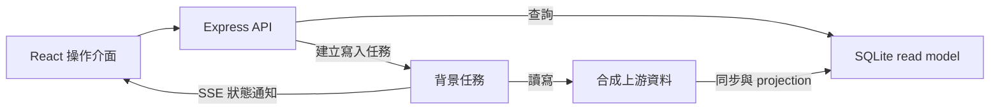

# 企業報工工具系統 — Demo

> 這是從實際內網產品架構整理出的公開技術展示版。保留正式資料流、背景任務、SQLite read model、SSE 即時更新與錯誤處理；上游資料、Definitions、會議內容與公司環境值則改用合成 fixture。


Demo 包含報工、停機、效率報表、會議錄音與 Developer／RAG 工具。報工寫入採背景任務，列表查詢優先讀取 SQLite；同步失敗時保留上一個完整版本，不會讓使用者看到只更新一半的資料。

**技術：** React 19、TypeScript 5.9、Vite 7、Ant Design 6、Node.js、Express、SQLite、SSE；語音辨識可選用 Python、FastAPI 與 faster-whisper，Dev AI 可選用本機 embedding 與向量索引。

[開始](#開始) · [功能](#功能) · [資料流](#資料流) · [展示順序](#展示順序) · [詳細文件](#詳細文件)

## 開始

請使用 Node.js **20.19.x 或 22.12+**。macOS／Linux 可直接執行下列指令；Windows 請使用 WSL。

```bash
npm install
npm run demo
```

首次啟動時，若 backend 或 frontend 尚未安裝依賴，啟動腳本會自動執行 `npm ci`。預設使用以下入口：

| 入口 | 內容 |
|---|---|
| [報工主畫面](http://localhost:5174) | 合成工令、報工與停機資料、任務中心 |
| [Developer Mode](http://localhost:5174/dev) | 合成 Definitions、欄位、公式與 RAG 工具；預設帳密 `demo` / `demo` |
| [Meeting](http://localhost:5174/meetings/audio-check) | 錄音檢查、分段上傳與錄音庫 |
| `http://localhost:3300` | Backend API |

可用 `Ctrl + C` 同時停止 frontend 與 backend。一般 Demo 不需要 AI API key，也不會下載模型；Dev AI 回答、語音辨識與 AI 會議摘要需要另外啟用對應 provider。設定方式見 [AI 與 STT 設定](docs/ai-setup.md)。

## 功能

| 模組 | 目前可展示的內容 |
|---|---|
| 報工與停機 | 工令篩選、報工操作、optimistic UI、任務狀態、資料同步與 A4 PDF |
| 效率報表 | 月報 CSV、分析 XLSX、歷史版本與既有檔案下載 |
| Meeting | 瀏覽器錄音、分段上傳、背景音訊工作、逐字稿與會議記錄流程 |
| Developer | 合成 Ragic Definitions、欄位搜尋、公式檢視與修改流程 |
| Dev AI／RAG | Lexical、hybrid 或 vector retrieval、來源版本、context 與 citation 分離 |
| 故障模擬 | 上游延遲、請求失敗與寫入掉欄位，用來觀察排程、重試及回復行為 |

## 資料流

### 查詢與同步

常用列表與明細優先讀取 SQLite。全量同步會先寫入新的 `generation_id`，完成後才更新 `active_generation_id`；同步期間繼續提供上一個完整版本，同步失敗也不會切換到半套資料。

程式入口：[work-report services](backend/src/services/work-report/) · [同步時序](docs/architecture.md#資料流sqlite-generation-swap)

### 寫入與任務狀態

前端送出報工後，後端建立背景任務並回傳 accepted 狀態。畫面先顯示暫存結果；worker 完成上游寫入與 SQLite projection 後，再透過 SSE 通知前端更新。若任務失敗，任務中心會保留原因，前端依最後結果回復暫存狀態。

程式入口：[workReportService.ts](backend/src/services/workReportService.ts) · [寫入一致性](docs/architecture.md#寫入一致性)

### 上游延遲與失敗

後端以 scheduler、token bucket、circuit breaker 與分流重試控制上游請求。Demo 的故障面板可以注入延遲、失敗率與寫入掉欄位；測試完成後應關閉故障注入，再送出一筆新任務確認系統已恢復。

程式入口：[infra](backend/src/infra/) · [故障展示設定](docs/development.md#本機啟動與故障展示)

### Meeting 與 RAG

Meeting 的錄音上傳、音訊處理、逐字稿與會議摘要各自使用背景工作；Python STT service 只負責語音辨識，不讀取報工資料。Dev AI 預設使用不需要模型的 lexical retrieval；hybrid／vector 模式使用固定版本的本機多語 embedding 與 SQLite 向量索引。

RAG 會分開保存兩種紀錄：`contextSources` 是實際送進模型的內容，`citedEvidence` 是回答明確引用的證據。每份來源也會保留版本 hash 與原文位置，方便日後核對回答當時使用的內容。

程式入口：[Dev AI](backend/src/services/dev/ai/) · [Python STT](services/meeting-stt/) · [啟用方式](docs/ai-setup.md)

## 架構概覽


```mermaid
flowchart LR
  UI[React 操作介面] --> API[Express API]
  API -->|查詢| SQLite[SQLite read model]
  API -->|建立寫入任務| Task[背景任務]
  Task -->|讀寫| Mock[合成上游資料]
  Mock -->|同步與 projection| SQLite
  Task -->|SSE 狀態通知| UI
```

上圖是報工資料流。Meeting 的音訊工作與 Dev AI 的檢索、模型及引用邊界，見 [架構與設計細節](docs/architecture.md)。

## 展示順序

1. 在報工主畫面篩選一筆合成工令，新增一筆報工，並到任務中心查看最後結果。
2. 觸發資料同步，對照 backend 日誌中的新 generation 與 active generation 切換。
3. 依 [故障展示設定](docs/development.md#本機啟動與故障展示) 開啟一種故障，再送出一筆操作，觀察任務狀態、錯誤訊息與回復行為。
4. 前往效率報表、Meeting 錄音庫與 Developer Mode 查看其他資料流。
5. 若已準備 provider 與模型，再展示逐字稿、會議摘要或帶來源引用的 Dev AI 回答。

## 更多畫面

<details>
<summary>展開效率報表、Meeting 與 Developer 畫面</summary>

**效率報表：** 期間 CSV、機台分析 XLSX 與歷史版本。


**Meeting：** 錄音檢查、會議記錄與錄音庫；AI 產出需另外啟用 provider。


**Developer：** 合成 Definitions、欄位公式與 Dev AI。


</details>

## 詳細文件

| 文件 | 內容 |
|---|---|
| [架構與設計細節](docs/architecture.md) | Generation swap、寫入一致性、背景任務、Meeting 與 RAG 邊界 |
| [開發、API 與驗證](docs/development.md) | 本機啟動、故障展示、目錄結構、API 與測試指令 |
| [AI 與 STT 設定](docs/ai-setup.md) | Lexical／hybrid／vector RAG、模型下載、索引、AI provider 與 Python STT |

## 資料範圍

- Demo 只使用合成工令、停機資料、Definitions 與一般化知識文件，不連線到公司 Ragic。
- Repo 不包含員工、客戶、正式料號、錄音、逐字稿、公司網址、內網 IP 或原始公司 `.nui`。
- `.env`、SQLite、cache、模型、錄音與生成檔都由 `.gitignore` 排除。
- Dev AI、語音辨識與會議摘要 provider 預設停用；只有操作者自行提供設定並明確啟用後才會呼叫。
- Demo 中的 Definitions 修改只作用於公開合成資料。

效能會受資料量、上游模式、模型與執行環境影響；需要比較效能時，請記錄相同資料與環境下的實際量測結果。
