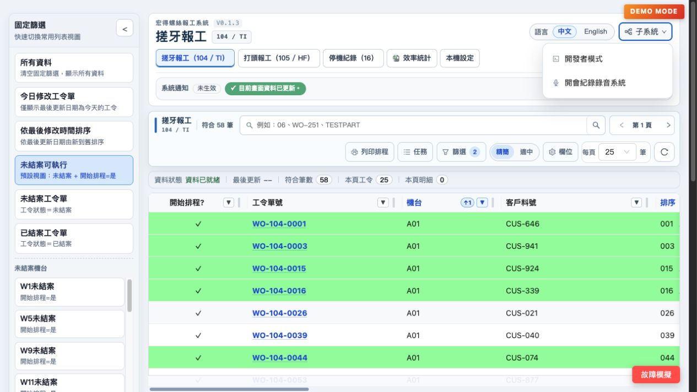
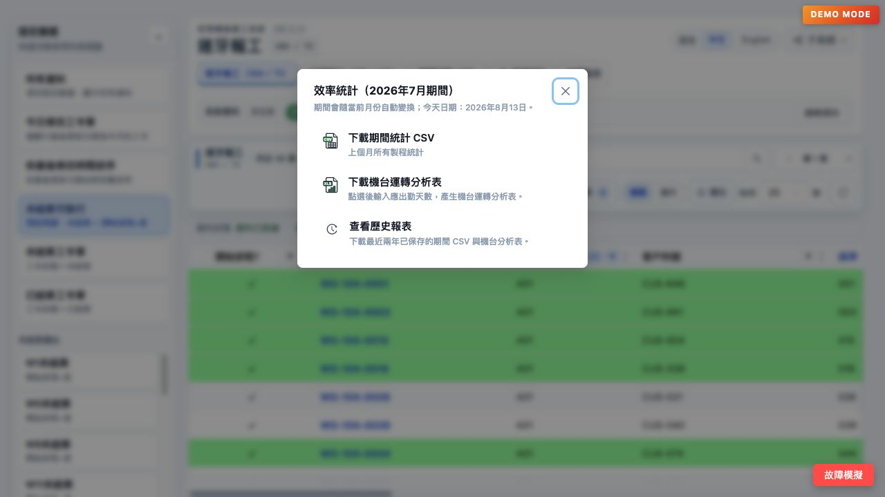
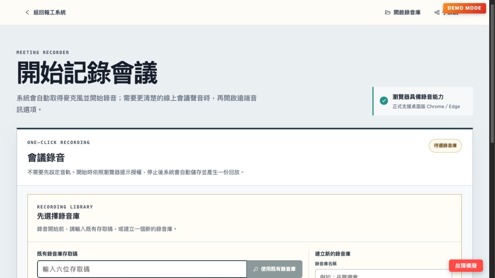
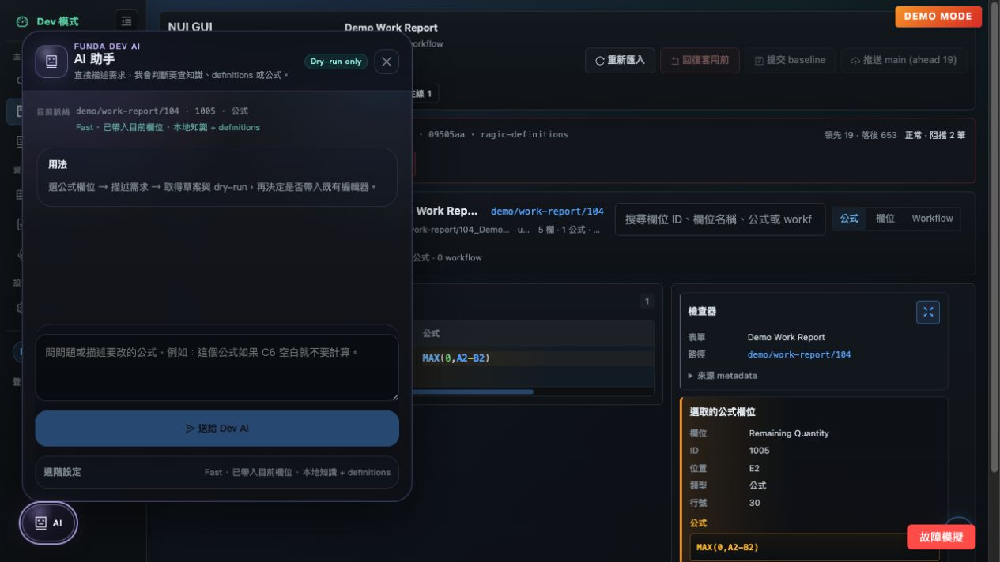
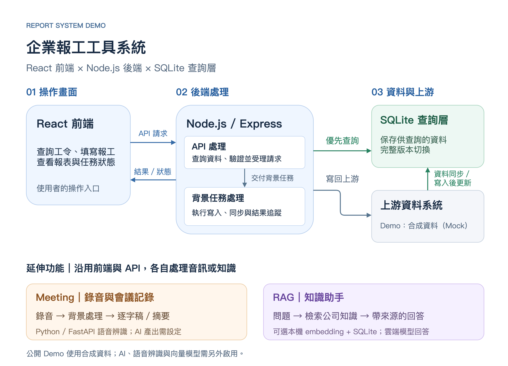
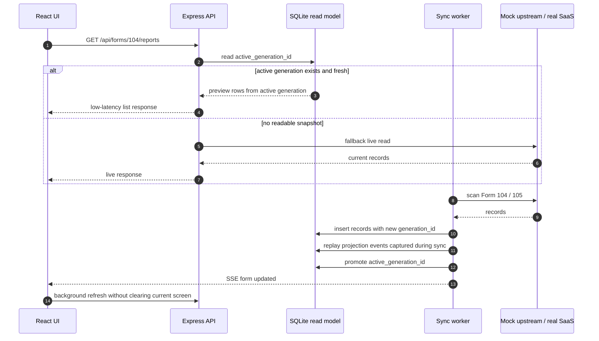

# 工廠營運平台 — 完整技術 Demo

> 這是從實際內網產品架構整理出的公開技術展示版。它不是單頁 UI mock，而是保留正式資料流、背景任務、SQLite read model、即時事件與錯誤治理的可執行系統；所有上游資料、Definitions、會議內容與公司環境值都改成 deterministic 合成 fixture。



_報工主畫面以 deterministic 合成工令運作；可從左上子系統選單切換 Meeting 與 Developer Mode，右下故障模擬則用來現場展示上游治理與回復流程。_

技術棧：**React 19 + Vite 7 + AntD 6** 前端／**Express 4 + TypeScript 5.9 + Node 20 + SQLite** 後端／可選的 **FastAPI + faster-whisper** 本機 STT service。

目前公開 Demo 包含四個可獨立展示的子系統：

| 子系統 | 可展示內容 |
|---|---|
| 報工與停機 | 工令列表、精確篩選、optimistic mutation、任務中心、同步、稽核、A4 PDF |
| 效率報表 | 月報 CSV、分析 XLSX、版本化封存、retention cleanup |
| Meeting | 瀏覽器錄音、分段上傳、背景音訊處理、逐字稿、會議記錄版本與錄音庫 |
| Developer | 合成 Ragic Definitions、欄位檢索、provider-based Dev AI、snapshot source API |

右下「故障模擬」panel 是 demo 專屬控制台，可即時注入 **上游失敗率 / 上游延遲 / 寫入時掉欄位** — 對應展示 circuit breaker / token bucket 排隊 / Form 16 write verifier 自動 rollback 三條防線。

### 介面導覽

#### 效率報表：可重現、可封存的輸出



期間統計、機台分析與歷史版本共用同一個 archive service；下載不是 UI 臨時拼檔，而是產生可追溯的 metadata 與 immutable artifact。

#### Meeting：不裝 AI key 也能展示完整工作流



Zero-config 模式仍保留錄音、chunk upload、durable processing job、錄音庫與權限流程；要展示真實逐字稿時，再 opt-in 啟動隔離的 STT provider。

#### Developer：公開 Definitions 與 provider-based Dev AI



Definitions、欄位、公式與 AI context 都來自公開合成 fixture。Demo 的 write action 固定為 dry-run，不會連到正式 Builder 或公司資料。

---

## 30 秒啟動

需要 Node 20+。

```bash
# 專案根目錄；首次 clone 安裝一鍵啟動器
npm install

# 同時啟動 Backend 與 Frontend
npm run demo
```

`npm run demo` 會在同一個 terminal 啟動 Backend `3300` 與 Frontend `5174`；子專案缺少 `node_modules` 時會自動執行 `npm ci`，按一次 `Ctrl + C` 即可一起停止。

打開 [http://localhost:5174](http://localhost:5174)，右上角會看到「DEMO MODE」徽章，列表已預載 80 筆假工令、約 400 筆報工列與合成停機紀錄。左上子系統選單可切換報工、Meeting 與 Developer Mode。

> 啟動時 80 筆工令與 6 條 linked source 表（機台 / 操作員 / 工序）會 deterministic 生成。重啟服務會回到初始 fixture。

開發者展示入口在 [http://localhost:5174/dev](http://localhost:5174/dev)。Demo 預設帳密為 `demo` / `demo`，可查看公開合成 Definitions、欄位檢索、SQLite generation swap 資料流與 mock 上游替換點；此入口不連正式 `.nui` 或真實 Ragic 資料。

Meeting 錄音入口在 [http://localhost:5174/meetings/audio-check](http://localhost:5174/meetings/audio-check)。Zero-config 模式保留錄音、chunk upload、processing job、library 與權限流程，但預設關閉 AI/STT provider，因此不需要第三方 API key。若要展示真實逐字稿，可依 [Meeting STT 說明](services/meeting-stt/README.md) 啟動隔離的 Python service，再於 backend env 啟用 provider。

本版已同步主系統近期資料流調整：報工與 Form 16 寫入在 accepted 後先以 optimistic overlay 更新畫面，再由背景 worker、registry 與 read-model projection 確認結果；新增 / 單筆刪除 / 批次新增 / 批次刪除都能在任務中心追蹤與重送。列表也加入精確篩選、欄位設定與 A4 PDF 排程下載，PDF 可調字級並以機台區隔連續排列。

---

## 系統架構



四條水平資料流分別對齊報工、效率報表、Meeting 與 Dev AI；每個子系統維持自己的 storage / provider contract，共用的只有 API、SSE 與 runtime 防線。

讀寫分離（CQRS）：報工寫入先經 Backend 處理業務邏輯，再同步回上游（唯一真實來源），同時投影到 SQLite 讀模型；前端熱查詢優先讀 SQLite active generation，缺 snapshot 或過舊時才 fallback 到上游。Demo mode 仍保留這條資料流，只把外部 SaaS 換成記憶體 mock fixture，不同步任何真實資料。

### 資料流：SQLite generation swap

Demo 版啟動後會在 1 秒內自動同步 Form 104 / 105 到 SQLite。同步不是在 live table 上長時間 `DELETE + INSERT`，而是寫入新的 `generation_id`，完成後才用很短的狀態更新把 `active_generation_id` 切過去。這讓前端讀取期間不會看到半套資料；同步失敗時，舊 generation 仍可讀。


```mermaid
sequenceDiagram
  autonumber
  participant UI as React UI
  participant API as Express API
  participant RM as SQLite read model
  participant Sync as Sync worker
  participant Upstream as Mock upstream / real SaaS

  UI->>API: GET /api/forms/104/reports
  API->>RM: read active_generation_id
  alt active generation exists and fresh
    RM-->>API: preview rows from active generation
    API-->>UI: low-latency list response
  else no readable snapshot
    API->>Upstream: fallback live read
    Upstream-->>API: current records
    API-->>UI: live response
  end

  Sync->>Upstream: scan Form 104 / 105
  Upstream-->>Sync: records
  Sync->>RM: insert records with new generation_id
  Sync->>RM: replay projection events captured during sync
  Sync->>RM: promote active_generation_id
  Sync-->>UI: SSE form updated
  UI->>API: background refresh without clearing current screen
```

---

## 核心技術亮點

這套系統是給工廠作業員 24 小時運作的內網生產系統。Demo 保留了下面所有機制（除了上游 SaaS 改成 mock），可以在面試現場一邊操作 UI 一邊講設計考量。

### 上游治理（[backend/src/infra/](backend/src/infra/)）
- **Token bucket 全域限流** — `RAGIC_GLOBAL_RATE_PER_SECOND` + `BURST_CAPACITY`，4 條 lane（user / sync / background / write）共用同一個 bucket，避免 22 個 slot burst 打爆上游
- **多 lane scheduler** — user / sync / background / write 各自獨立 concurrency，背景任務不會擠掉使用者請求
- **Circuit breaker** — 連續失敗 N 次 cooldown，retry 移出 lane（背壓不阻塞 slot）
- **Read/Write retry** — 分讀寫策略，read 可重試、create 不重試（避免重複建立）

### 讀取分層（[backend/src/services/work-report/](backend/src/services/work-report/)）
- **SQLite active generation**：列表、詳情、分面統計優先讀 `active_generation_id`，同步期間舊 snapshot 仍可服務前景請求
- **Generation swap**：全量同步寫入新世代，完成後再切 active pointer，避免半套資料與 UI 閃爍
- **三層快取**：node-cache（記憶體）+ full snapshot cache（檔案）+ SQLite read model
- **Preview-first**：列表預設只讀主表欄位、面板互動才 on-demand full hydration
- **Stale-while-revalidate** 模式 + 啟動預熱（demo 下關閉）

### 寫入一致性
- **任務化 mutation**：報工新增、單筆刪除、批次新增、批次刪除都走 accepted task + registry；前端任務中心可看 pending/running/success/failed 與重送提示
- **Optimistic overlay**：accepted 後立即在列表／明細反映暫存結果；worker 若回 conflict 或 failed，前端依 terminal lifecycle rollback，避免使用者長時間卡在同步 spinner
- **Mutation / sync 協調**：依 form 隔離寫入與全量同步，寫入期間延後同 form sync；projection 完成後再發布 realtime event，避免另一個分頁看到尚未落入 read model 的資料
- **Idempotency**：`x-client-mutation-id` 透過 `clientRowKey` 對應上游 rowId，重送同 ID 不會重複建立 — 見 [backend/src/services/workReportService.ts](backend/src/services/workReportService.ts)
- **Form 16 ↔ Form 104/105 子表連動**：報工列建立在 Form 16 (停機紀錄)，由上游 workflow 自動推回工令子表；mock 在 [backend/src/ragic/mockClient.ts](backend/src/ragic/mockClient.ts) 模擬同樣的 propagation 語意
- **Write verify**：create 完立刻讀回比對，欄位不一致就自動 DELETE 止血（避免 orphan 種子）
- **Post-create polling**：拿到 form 16 rowId 後輪詢工令子表確認 row 出現再回應
- **Form 16 停機 queue**：`/downtime` 新增停機採 `16:downtime:create` 串行 queue，成功寫回 entryId，失敗保留本機 payload 可重送

### 列表與輸出
- **精確篩選與欄位設定**：常用條件、欄位顯示／色彩／順序與本機偏好分離，套用前保留草稿狀態
- **PDF 排程**：瀏覽器內直接產生固定 A4 PDF，可調字級；機台區塊連續向下排列，跨頁時重複顯示機台標識
- **分批 rasterize**：PDF 以小批次 canvas 轉圖並主動釋放暫存 DOM，降低大量排程下載時的主執行緒與記憶體尖峰

### 即時推送（[backend/src/events/realtimeEventBus.ts](backend/src/events/realtimeEventBus.ts)）
- Server-Sent Events 全域 bus，每次 mutation 發布 form / row update 事件
- 前端 [useWorkReportListDataSync](frontend/src/features/work-report/hooks/useWorkReportListDataSync.ts) 自動 reconnect、去重、deferred refresh

### 觀測性 / 開發者模式
- 後端結構化日誌（Pino）+ 全棧 boot/deploy version
- 前端 [Developer Contract](frontend/src/features/work-report/debug/workReportDeveloperContract.ts) — ui / api / task / realtime / navigation 事件契約全紀錄
- 診斷面板可即時查 hydration source、cache state、SSE 連線、SQLite snapshot age

### 認證 / 多裝置
- 系統通知管理端使用 session token、登入限速與 demo 帳密（`demo` / `demo`）
- Debug clients presence 帶 `clientId` / `tabId` / `clientBootId` 身份驗證；disconnect 不會清掉尚未 ACK 的管理命令，避免重新整理時遺失控制訊號

### 資料治理
- **Record audit log**：每筆 update / delete 全量前後快照、操作人、時戳，前端 UI 可看歷史
- **Form 16 孤兒清理**：背景週期掃 createdAt > 10 分鐘且符合條件的記錄做 soft delete（demo 下關閉）

### 效率報表封存
- Form 16 月報 CSV 與分析 XLSX 由同一個 archive service 產生，避免 UI 直接依賴臨時檔
- SQLite metadata + immutable artifacts 保存來源列數、檔案大小、版本與衍生參數
- 歷史 modal 可重下載既有版本；cleanup job 依 retention 刪除過期 artifact，Demo 預設保守關閉

### Meeting 錄音與會議記錄
- `MediaRecorder` 雙來源錄音、chunk sequence/idempotency、session owner cookie 與 library viewer code
- 音訊處理、逐字稿、會議記錄拆成三種 durable SQLite jobs；worker 有 lease、heartbeat、retry 與 shutdown recovery
- 逐字稿支援 10 分鐘 checkpoint、來源標識、全文搜尋與可編輯 document；會議記錄保存 HTML/JSON artifact 與版本
- STT service 與報工 backend 隔離：Python 只接 canonical WAV，不讀 Ragic、報工 SQLite 或 Dev AI

### Dev AI 與 Definitions
- Provider factory 將 Google Gemini、MiniMax 與 disabled mode 收斂成同一 contract；Demo 預設 disabled，沒有 key 也能啟動
- `ragic-definitions/` 只含兩張合成表單，讓搜尋、關聯欄位、formula 與 workflow explorer 有可操作資料
- Definitions export 使用 child process、atomic swap、revision snapshot、ETag 與 compressed source API；不把原始公司 `.nui` 放進公開 repo

---

## Demo 模式運作

| 元件 | 真實版 | Demo 版 |
|---|---|---|
| 上游讀寫 | HTTPS → SaaS form API | 記憶體 Map，毫秒回應 |
| SQLite read model | 啟動同步 / callback 投影 | Demo 啟動 1 秒後自動同步 104 / 105，讀取優先走 active generation |
| Token bucket / scheduler | 真正排程 | 仍運作，stats 可從 [debug clients](backend/src/routes/debugClients.ts) 看到 |
| SSE 推送 | 真實 | 真實 |
| Idempotency | clientRowKey ↔ 上游 rowId | clientRowKey ↔ mock ID |
| 任務 registry | SQLite / JSON 持久化 | 同樣持久化到本機 `.cache` / Fly `/data` |
| Form 16 連動 | 上游 workflow | mockClient.propagateForm16ToParentSubtable |
| 預熱 / 自動同步 | 啟用 | full-cache prewarm 關閉；104 / 105 SQLite auto-sync 開啟 |
| 效率報表封存 | SQLite + 檔案 storage | 使用本機 `.data`，保留完整 route/service/repository |
| Meeting provider | local Whisper / MiniMax | 預設 disabled；錄音、job、library 仍可操作 |
| Ragic Definitions | Builder `.nui` export | 公開合成 fixture，不讀公司 Builder 或正式資料 |

實作：
- **替換點**：[backend/src/ragic/client.ts](backend/src/ragic/client.ts) 出口處 `createRagicClient()` 依 `env.DEMO_MODE` 決定 export `RagicClient` 還是 in-memory mock client
- **業務邏輯零修改**：所有 routes / services / hooks 都用同一個 `ragicClient`，沒人知道底下是 mock 還是 SaaS
- **環境變數注入**：[backend/src/config/env.ts](backend/src/config/env.ts) 在 `DEMO_MODE=true` 時自動填入必填的上游 env 預設值，並自動啟用 104 / 105 SQLite read-model + auto-sync

啟動後可以用 log 確認 generation swap 已啟動：

```text
[sqlite-auto-sync-scheduled] { forms: [ '104', '105' ], ... }
[work-report-debug] { scope: 'sync', action: 'succeeded', formId: '104', activeGenerationId: '...', syncedEntries: 80, syncedRows: 430 }
[work-report-debug] { scope: 'sync', action: 'succeeded', formId: '105', activeGenerationId: '...', syncedEntries: 30, syncedRows: 76 }
```

---

## 專案結構

```text
report-system-demo/
├── backend/
│   ├── src/
│   │   ├── ragic/            ← 上游客戶端（含 mockClient + demoFixture）
│   │   ├── routes/           ← Express 路由
│   │   ├── services/         ← 業務邏輯（read/write/idempotency/recalculate）
│   │   ├── infra/            ← scheduler / circuit breaker / retry
│   │   ├── storage/sqlite/   ← SQLite read model
│   │   ├── storage/meeting-minutes/ ← Meeting durable jobs / library
│   │   ├── storage/efficiency-report/ ← 報表版本與 artifact metadata
│   │   ├── workers/          ← Meeting lease/heartbeat worker
│   │   ├── events/           ← SSE 推送
│   │   ├── observability/    ← 日誌 / presence / boot state
│   │   └── server.ts
│   └── .env.demo             ← Demo 環境範例（npm run demo 已自動注入）
├── frontend/
│   └── src/
│       ├── api/              ← axios 工廠
│       ├── components/       ← 共用元件（含 DemoBadge）
│       ├── features/work-report/
│       │   ├── pages/        ← list / detail
│       │   ├── components/   ← 表格 / 過濾 / 分析 / 同步進度
│       │   ├── hooks/        ← 100+ 個專責 hook（dataPipeline / refresh / events）
│       │   └── debug/        ← 開發者模式契約
│       ├── features/meeting-minutes/ ← 錄音、逐字稿、會議記錄與 library
│       ├── features/dev/     ← Definitions explorer 與 provider-based Dev AI
│       └── i18n/             ← 中英繁簡
├── services/meeting-stt/     ← 隔離的 FastAPI + faster-whisper service
├── ragic-definitions/        ← 公開合成 Definitions fixture
├── .github/workflows/ci.yml  ← Node/Python 三條驗證 job
└── scripts/                  ← 本機啟動腳本
```

---

## 主要 API

完整列表見 [backend/src/routes/](backend/src/routes/)：

```
GET    /api/forms/104/reports                  工令列表（preview）
GET    /api/forms/104/reports/full             全量資料（含子表）
GET    /api/forms/104/reports/facets           分面分析
GET    /api/forms/104/reports/:entryId         單筆 + 子表
POST   /api/forms/104/reports/:entryId         新增報工列（accepted task）
PUT    /api/forms/104/reports/:entryId/:rowId  更新
DELETE /api/forms/104/reports/:entryId/:rowId  刪除（accepted task）
POST   /api/forms/104/reports/:entryId/batch-create  批次新增
POST   /api/forms/104/reports/:entryId/batch-delete   批次刪除
GET    /api/forms/104/tasks                    任務中心列表
GET    /api/downtime/tasks                     停機新增任務列表
GET    /api/downtime/efficiency-reports        效率報表版本歷史
GET    /api/downtime/export/monthly-csv        產生／下載月報 CSV
GET    /api/downtime/export/analysis-xlsx      產生／下載分析 XLSX
POST   /api/meetings/recordings                建立錄音 session
PUT    /api/meetings/recordings/:id/tracks/:source/chunks/:seq  冪等上傳音訊 chunk
POST   /api/meetings/recordings/:id/process    建立音訊處理 job
POST   /api/meetings/recordings/:id/transcriptions  建立逐字稿 job
POST   /api/meetings/recordings/:id/minutes    建立會議記錄 job
GET    /api/integrations/ragic-definitions/state     Definitions source revision
GET    /api/integrations/ragic-definitions/snapshot  Definitions 壓縮快照
POST   /api/forms/104/sync                     觸發 SQLite 同步
GET    /api/events                             SSE 即時事件流
GET    /api/health                             健康 + demoMode flag
```

Demo 下可直接 curl 試：
```bash
curl http://localhost:3300/api/forms/104/reports?limit=5
```

---

## 驗證矩陣

```bash
# Backend：型別、編譯、route/service/storage/worker 測試
cd backend
npm run typecheck
npm run build
npm test

# Frontend：lint、unit/component、production bundle
cd ../frontend
npm run lint
npm test
npm run build

# Meeting STT：fake engine，不下載模型、不需要 GPU
cd ../services/meeting-stt
uv sync --locked --python 3.11 --dev
uv run pytest
```

GitHub Actions 會分別執行 `meeting-stt`、`backend`、`frontend` 三個 job。測試 backend 強制使用獨立暫存 SQLite 與不可連線的假 upstream host，避免開發機 `.env`、本機服務或正式上游污染結果。

## 公開版資料邊界

- `DEMO_MODE=true` 時 upstream 一律走 [mockClient](backend/src/ragic/mockClient.ts)，不會呼叫公司 Ragic。
- Repo 只包含合成工令、停機、Definitions 與一般化 IT SOP；不包含員工、客戶、料號、錄音、逐字稿或內網位址。
- `.env`、SQLite、cache、錄音與生成 artifacts 都在 `.gitignore`；部署持久資料統一放 `/data`。
- Meeting AI/STT 與 Dev AI provider 預設為 `disabled`。只有操作者明確提供自己的 endpoint/key 並啟用時才會呼叫外部 provider。
