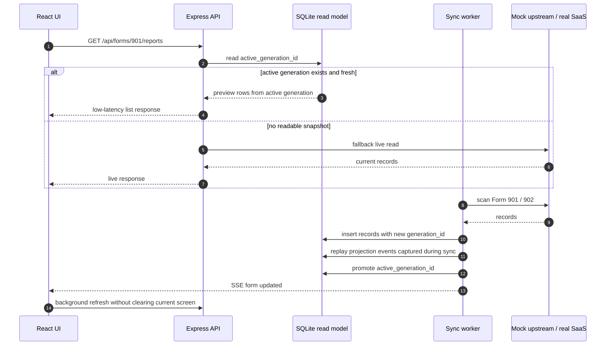

# 架構與設計細節

[返回首頁](../README.md) · [開發與驗證](development.md) · [AI 與 STT 設定](ai-setup.md)


上半部由左至右說明操作畫面、後端處理與資料來源，並分開呈現 SQLite 查詢和上游寫入。下半部整理 Meeting 與 RAG 的處理流程。

讀寫分離（CQRS）：報工寫入先經 Backend 處理業務邏輯，再同步回上游（唯一真實來源），同時投影到 SQLite 讀模型；前端熱查詢優先讀 SQLite active generation，缺 snapshot 或過舊時才 fallback 到上游。Demo mode 仍保留這條資料流，只把外部 SaaS 換成記憶體 mock fixture，不同步任何真實資料。

## 資料流：SQLite generation swap

Demo 版啟動後會排程將 Form 901 / 902 同步到 SQLite；完成時間取決於資料量與執行環境。同步不是在 live table 上長時間 `DELETE + INSERT`，而是寫入新的 `generation_id`，完成後才用很短的狀態更新把 `active_generation_id` 切過去。這讓前端讀取期間不會看到半套資料；同步失敗時，舊 generation 仍可讀。



---

## 核心技術亮點

以下整理公開 Demo 的實作位置與設計細節；涉及 provider 的功能需依設定另行啟用。

### 上游治理（[backend/src/infra/](../backend/src/infra/)）

- **Token bucket 全域限流** — `RAGIC_GLOBAL_RATE_PER_SECOND` + `BURST_CAPACITY`，4 條 lane（user / sync / background / write）共用同一個 bucket，避免 22 個 slot burst 打爆上游
- **多 lane scheduler** — user / sync / background / write 各自獨立 concurrency，背景任務不會擠掉使用者請求
- **Circuit breaker** — 連續失敗 N 次 cooldown，retry 移出 lane（背壓不阻塞 slot）
- **Read/Write retry** — 分讀寫策略，read 可重試、create 不重試（避免重複建立）

### 讀取分層（[backend/src/services/work-report/](../backend/src/services/work-report/)）

- **SQLite active generation**：列表、詳情、分面統計優先讀 `active_generation_id`，同步期間舊 snapshot 仍可服務前景請求
- **Generation swap**：全量同步寫入新世代，完成後再切 active pointer，避免半套資料與 UI 閃爍
- **三層快取**：node-cache（記憶體）+ full snapshot cache（檔案）+ SQLite read model
- **Preview-first**：列表預設只讀主表欄位、面板互動才 on-demand full hydration
- **Stale-while-revalidate** 模式 + 啟動預熱（demo 下關閉）

### 寫入一致性

- **任務化 mutation**：報工新增、單筆刪除、批次新增、批次刪除都走 accepted task + registry；前端任務中心可看 pending/running/success/failed 與重送提示
- **Optimistic overlay**：accepted 後立即在列表／明細反映暫存結果；worker 若回 conflict 或 failed，前端依 terminal lifecycle rollback，避免使用者長時間卡在同步 spinner
- **Mutation / sync 協調**：依 form 隔離寫入與全量同步，寫入期間延後同 form sync；projection 完成後再發布 realtime event，避免另一個分頁看到尚未落入 read model 的資料
- **Idempotency**：`x-client-mutation-id` 透過 `clientRowKey` 對應上游 rowId，重送同 ID 不會重複建立 — 見 [backend/src/services/workReportService.ts](../backend/src/services/workReportService.ts)
- **activity log ↔ Form 901/902 子表連動**：報工列建立在 activity log (停機紀錄)，由上游 workflow 自動推回工令子表；mock 在 [backend/src/ragic/mockClient.ts](../backend/src/ragic/mockClient.ts) 模擬同樣的 propagation 語意
- **Write verify**：create 完立刻讀回比對，欄位不一致就自動 DELETE 止血（避免 orphan 種子）
- **Post-create polling**：拿到 activity log rowId 後輪詢工令子表確認 row 出現再回應
- **activity log 停機 queue**：`/downtime` 新增停機採 `903:downtime:create` 串行 queue，成功寫回 entryId，失敗保留本機 payload 可重送

### 列表與輸出

- **精確篩選與欄位設定**：常用條件、欄位顯示／色彩／順序與本機偏好分離，套用前保留草稿狀態
- **PDF 排程**：瀏覽器內直接產生固定 A4 PDF，可調字級；機台區塊連續向下排列，跨頁時重複顯示機台標識
- **分批 rasterize**：PDF 以小批次 canvas 轉圖並主動釋放暫存 DOM，降低大量排程下載時的主執行緒與記憶體尖峰

### 即時推送（[backend/src/events/realtimeEventBus.ts](../backend/src/events/realtimeEventBus.ts)）

- Server-Sent Events 全域 bus，每次 mutation 發布 form / row update 事件
- 前端 [useWorkReportListDataSync](../frontend/src/features/work-report/hooks/useWorkReportListDataSync.ts) 自動 reconnect、去重、deferred refresh

### 觀測性 / 開發者模式

- 後端結構化日誌（Pino）+ 全棧 boot/deploy version
- 前端 [Developer Contract](../frontend/src/features/work-report/debug/workReportDeveloperContract.ts) — ui / api / task / realtime / navigation 事件契約全紀錄
- 診斷面板可即時查 hydration source、cache state、SSE 連線、SQLite snapshot age

### 認證 / 多裝置

- 系統通知管理端使用 session token、登入限速與 demo 帳密（`demo` / `demo`）
- Debug clients presence 帶 `clientId` / `tabId` / `clientBootId` 身份驗證；disconnect 不會清掉尚未 ACK 的管理命令，避免重新整理時遺失控制訊號

### 資料治理

- **Record audit log**：每筆 update / delete 全量前後快照、操作人、時戳，前端 UI 可看歷史
- **activity log 孤兒清理**：背景週期掃 createdAt > 10 分鐘且符合條件的記錄做 soft delete（demo 下關閉）

### 效率報表封存

- activity log 月報 CSV 與分析 XLSX 由同一個 archive service 產生，避免 UI 直接依賴臨時檔
- SQLite metadata + immutable artifacts 保存來源列數、檔案大小、版本與衍生參數
- 歷史 modal 可重下載既有版本；cleanup job 依 retention 刪除過期 artifact，Demo 預設保守關閉

### Meeting 錄音與會議記錄

- `MediaRecorder` 雙來源錄音、chunk sequence/idempotency、session owner cookie 與 library viewer code
- 音訊處理、逐字稿、會議記錄拆成三種 durable SQLite jobs；worker 有 lease、heartbeat、retry 與 shutdown recovery
- 逐字稿支援 10 分鐘 checkpoint、來源標識、全文搜尋與可編輯 document；會議記錄保存 HTML/JSON artifact 與版本
- STT service 與報工 backend 隔離：Python 只接 canonical WAV，不讀 Ragic、報工 SQLite 或 Dev AI

### Dev AI 與 Definitions

- Provider factory 將 Google Gemini、MiniMax 與 disabled mode 收斂成同一 contract；Demo 預設 disabled，沒有 key 也能啟動
- RAG 預設使用不需模型的 lexical retrieval；可選的 hybrid/vector 模式使用固定版本的本機多語 embedding、SQLite 向量快照與 reciprocal-rank fusion
- 每份檢索結果保存完整來源版本 hash 與原文 offset；`contextSources` 記錄實際送進模型的內容，`citedEvidence` 只記錄模型明確引用的證據
- `ragic-definitions/` 只含兩張合成表單，讓搜尋、關聯欄位、formula 與 workflow explorer 有可操作資料
- Definitions export 使用 child process、atomic swap、revision snapshot、ETag 與 compressed source API；不把原始公司 `.nui` 放進公開 repo

本機模型下載、索引準備及 provider 設定見 [AI 與 STT 設定](ai-setup.md)。

---

## Demo 模式運作

| 元件 | 真實版 | Demo 版 |
|---|---|---|
| 上游讀寫 | HTTPS → SaaS form API | 記憶體 Map，可注入延遲與失敗 |
| SQLite read model | 啟動同步 / callback 投影 | Demo 啟動後排程同步 901 / 902，讀取優先走 active generation |
| Token bucket / scheduler | 真正排程 | 仍運作，stats 可從 [debug clients](../backend/src/routes/debugClients.ts) 看到 |
| SSE 推送 | 真實 | 真實 |
| Idempotency | clientRowKey ↔ 上游 rowId | clientRowKey ↔ mock ID |
| 任務 registry | SQLite / JSON 持久化 | 同樣持久化到本機 `.cache` / Fly `/data` |
| activity log 連動 | 上游 workflow | mockClient.propagateActivityLogToParentSubtable |
| 預熱 / 自動同步 | 啟用 | full-cache prewarm 關閉；901 / 902 SQLite auto-sync 開啟 |
| 效率報表封存 | SQLite + 檔案 storage | 使用本機 `.data`，保留完整 route/service/repository |
| Meeting provider | local Whisper / MiniMax | 預設 disabled；錄音、job、library 仍可操作 |
| Ragic Definitions | Builder `.nui` export | 公開合成 fixture，不讀公司 Builder 或正式資料 |

實作：

- **替換點**：[backend/src/ragic/client.ts](../backend/src/ragic/client.ts) 出口處 `createRagicClient()` 依 `env.DEMO_MODE` 決定 export `RagicClient` 還是 in-memory mock client
- **上游介面替換**：透過共用的 `ragicClient` 介面，讓報工流程在 Demo 中使用合成上游資料
- **環境變數注入**：[backend/src/config/env.ts](../backend/src/config/env.ts) 在 `DEMO_MODE=true` 時自動填入必填的上游 env 預設值，並自動啟用 901 / 902 SQLite read-model + auto-sync

以下為同步日誌格式範例；generation ID、筆數與完成時間以該次執行結果為準：

```text
[sqlite-auto-sync-scheduled] { forms: [ '901', '902' ], ... }
[work-report-debug] { scope: 'sync', action: 'succeeded', formId: '901', activeGenerationId: '...', syncedEntries: 80, syncedRows: 430 }
[work-report-debug] { scope: 'sync', action: 'succeeded', formId: '902', activeGenerationId: '...', syncedEntries: 30, syncedRows: 76 }
```
